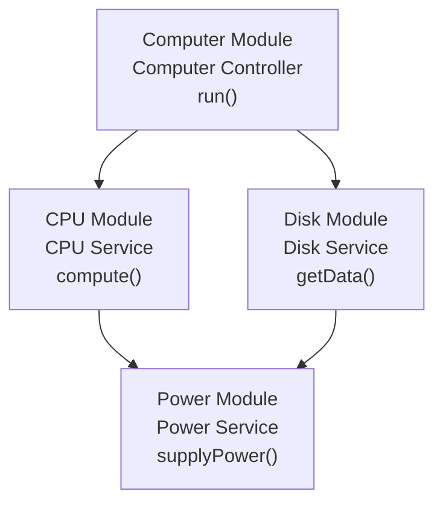

# Flowchart

 

 
 

## Dependency Injection

<image width="600px" height="400px" src="./public/di_inside_module.png">

 

<image width="600px" height="400px" src="./public/di_between_module.png">

 

-   By default, all the different services that we wire up to a module and list inside `"providers" array are private!`
-   In other words, services in providers array can not be accessed by any other module
-   To change that, we have to add in a new property to the @Module() decorator called `"exports"`
-   Anything we list inside the array of providers is going to be accessible only inside the module unless we add it to the list of exports

 

<image width="600px" height="300px" src="./public/di_desc1.png">

 

<image width="600px" height="420px" src="./public/di_desc2.png">
